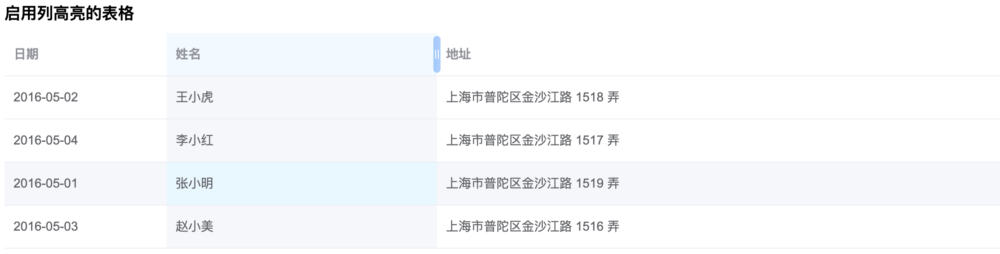

# El Table Enhance

Element UI 表格增强插件，为 Element UI 的 `el-table` 组件提供列高亮和可拖拽调整列宽功能。

## 功能特性

### 🎯 列高亮功能
- 鼠标悬停时高亮整列（包括表头和表体）
- 支持斑马纹表格 

### 📏 列宽拖拽调整
- 无需开启 `border` 属性即可调整列宽
- 鼠标悬停列时显示拖拽手柄  
- 实时调整列宽，无需等待拖拽结束

## 效果展示



## 安装

```bash
npm install el-table-enhance
```

## 使用方法

### 1. 全局注册插件

```javascript
import Vue from 'vue'
import ElementUI from 'element-ui'
import ElTableEnhance from 'el-table-enhance'
import 'el-table-enhance/dist/index.css'

Vue.use(ElementUI)
Vue.use(ElTableEnhance)
```

### 2. 在组件中使用

```vue
<template>
  <el-table 
    :data="tableData" 
    highlightCol
    resizable
  >
    <el-table-column prop="name" label="姓名" />
    <el-table-column prop="age" label="年龄" />
    <el-table-column prop="address" label="地址" />
  </el-table>
</template>

<script>
export default {
  data() {
    return {
      tableData: [
        { name: '张三', age: 25, address: '北京市朝阳区' },
        { name: '李四', age: 30, address: '上海市浦东新区' },
        { name: '王五', age: 28, address: '广州市天河区' }
      ]
    }
  }
}
</script>
```

## 配置选项

### el-table 新增属性

| 属性名 | 类型 | 默认值 | 说明 |
|--------|------|--------|------|
| `highlight-columns` | Boolean | `false` | 是否启用列高亮功能 |
| `resizable` | Boolean | `false` | 是否启用列宽拖拽调整功能 |

## 样式自定义

### 列高亮样式

```scss
// 自定义列高亮颜色
.el-table .el-table-enhanced-col-hover {
  background-color: #your-color !important;
}

// 自定义表头高亮样式
.el-table th.el-table-enhanced-col-hover {
  background-color: #your-header-color !important;
  font-weight: 600;
}
```

### 拖拽手柄样式

```scss
// 自定义拖拽手柄样式
.el-table-resize-handle {
  background: #your-handle-color;
  width: 8px;
  
  &:hover {
    background: #your-hover-color;
  }
}
```

## 兼容性

- Vue 2.6+ 

## 注意事项

1. **列宽调整功能**：
   - 最后一列不支持调整宽度（避免表格布局问题）
   - 调整过程中会自动设置 `table-layout: fixed` 

2. **样式优先级**：
   - 插件使用 `!important` 确保样式生效
   - 如需自定义样式，请使用更高优先级的选择器


## License

MIT